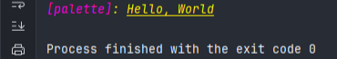

[](https://github.com/rejchev/palette/actions/workflows/ci.yml)
[](https://pkg.go.dev/github.com/rejchev/palette/v2)

# Palette
A simple palette based on SGR:
- [ECMA-35: Character Code Structure and Extension Techniques (eq. ISO 2022)](https://putty.org.ru/specs/ecma-035.pdf)

The Palette allows you to replace keywords in plain text with SGR before output

## About
Palette works like a processor and has a set of commands.\
Each command is processed, and an `SGR` sequence is formed at the ```palette.Set()``` stage.\
Processed commands are stored in palette under user-defined names in the order of declaration.\
Commands that are not familiar to the processor aren't processed and placed in the sequence as it is. \
It is allowed to process a sequence of commands separated by the character `;`.

#### note: *effect of commands works until the opposite is said*

### Commands
Now available two types of commands:
- `primitive` - mono-word (uniq)
- `associative` - mono-word that is associated with delimited via `:` value (uniq)

### Command list
Available commands with types:

| Command | Type         | Example       | Description                                                                                                                                       |
|---------|--------------|---------------|---------------------------------------------------------------------------------------------------------------------------------------------------|
| R       | primitive    | "R"           | Reset or Normal                                                                                                                                   |
| B       | primitive    | "B"           | Bold or increased intensity                                                                                                                       |
| L       | primitive    | "L"           | May be implemented as a light font weight like bold                                                                                               |
| I       | primitive    | "I"           | Italic. Sometimes treated as inverse or blink (not widely supported)                                                                              |
| U       | primitive    | "U"           | Underline                                                                                                                                         |
| SB      | primitive    | "SB"          | Slow blink                                                                                                                                        |
| RB      | primitive    | "RB"          | Rapid blink                                                                                                                                       |
| REV     | primitive    | "REV"         | Reverse video or invert (swap foreground and background colors)                                                                                   |
| HIDE    | primitive    | "HIDE"        | Conceal or hide (not widely supported)                                                                                                            |
| CO      | primitive    | "CO"          | Crossed-out, or strike (characters legible but marked as if for deletion)                                                                         |
| C       | associative  | "C:30"        | Color in ranges: <br/>- [30-37] - foreground; <br/>- [40-47] - background;<br/>- [90-97] - bright foreground;<br/>- [100-107] - bright background |
| FTC     | associative  | "FTC:1"       | Foreground [tabled](https://en.wikipedia.org/wiki/ANSI_escape_code#8-bit) colors: [0-255]                                                         |
| BTC     | associative  | "BTC:241"     | Background [tabled](https://en.wikipedia.org/wiki/ANSI_escape_code#8-bit) colors: [0-255]                                                         |
| UTC     | associative  | "UTC:144"     | Underline [tabled](https://en.wikipedia.org/wiki/ANSI_escape_code#8-bit) colors: [0-255]                                                          |
| FHC     | associative  | "FHC:#FFF444" | Foreground `#HEX` colors                                                                                                                          |
| BHC     | associative  | "BHC:#FFF111" | Background `#HEX` colors                                                                                                                          |
| UHC     | associative  | "UHC:#111444" | Underline `#HEX` colors                                                                                                                           |

### Command combinations
You can combine commands, as [mentioned](#about), using delimiter - `;` per command:
- ```"I;FTC:240"``` - italic foreground tabled color
- ```"I;U;FHC:#FFF000"``` - italic underlined foreground hex color
- ...


## Install
```
go get github.com/rejchev/palette/v2
```

## Configure
First of all u must configure palette

### Palette
Palette contains one key - `palette` and this is array of entries, where entry:
- `key` is user based uniq sequence
- `value` is a template sequence that can contain [commands](#commands)

### Base configuration
Package provide base config by `GetBasePaletteConfig()` with next necessary keys:
```go
[]palette.Entry {
    // Base controls
    {"{R}", "R"},       // Reset
    {"{B}", "B"},       // Bold
    {"{L}", "L"},       // Light
    {"{I}", "I"},       // Italic
    {"{U}", "U"},       // Underlined
    {"{SB}", "SB"},     // Slow blink
    {"{RB}", "RB"},     // Rapid blink
    {"{REV}", "REV"},   // Swap foreground and background colors; inconsistent emulation
    {"{HIDE}", "HIDE"}, // Conceal or hide (Not widely supported)
    {"CO", "CO"},       // Crossed-out, or strike
    
    // Base Foreground colors
    {"{FBA}", "C:30"}, // Black
    {"{FRD}", "C:31"}, // Red
    {"{FGR}", "C:32"}, // Green
    {"{FYL}", "C:33"}, // Yellow
    {"{FBU}", "C:34"}, // Blue
    {"{FMA}", "C:35"}, // Magenta
    {"{FCY}", "C:36"}, // Cyan
    {"{FWH}", "C:37"}, // White
    
    // Base background colors
    {"{BBA}", "C:40"}, // Black
    {"{BRD}", "C:41"}, // Red
    {"{BGR}", "C:42"}, // Green
    {"{BYL}", "C:43"}, // Yellow
    {"{BBU}", "C:44"}, // Blue
    {"{BMA}", "C:45"}, // Magenta
    {"{BCY}", "C:46"}, // Cyan
    {"{BWH}", "C:47"}, // White
}
```
#### note: *`you` can `define` your own or `expand` existing `set` `at any time`*

## Usage
### Initializing
First of all u must initialize palette once using [config](#configure) (on `main` func for example):
```go
package main

import (
	"fmt"
	"github.com/rejchev/palette"
)

func main() {
	palette.Init(getPaletteConfig())
}

func getPaletteConfig() *palette.Config {
	return palette.NewConfig(append([]palette.Entry {
		palette.CreateEntry("{IAPPLE}", "{I}{APPLE}"),
		palette.CreateEntry("{IBRW}", "{I}{BRW}"),
		palette.CreateEntry("{APPLE}", "FHC:#FFF000"),
		palette.CreateEntry("{BRW}", "FTC:200"),
	}, palette.GetBasePaletteConfig().Palette()...,
	))
}
```

### Usaging
After successfully `Init()`, you can `Use()` it:
```go
package main

import (
	"fmt"
	"github.com/rejchev/palette"
)

func main() {
	palette.Init(getPaletteConfig())

	fmt.Printf(palette.Use("{IBRW}[palette]{IAPPLE}: {U}%s{R}\n"), "Hello, World")
}

func getPaletteConfig() *palette.Config {
	return palette.NewConfig(append([]palette.Entry{
		palette.CreateEntry("{IAPPLE}", "{I}{APPLE}"),
		palette.CreateEntry("{IBRW}", "{I}{BRW}"),
		palette.CreateEntry("{APPLE}", "FHC:#FFF000"),
		palette.CreateEntry("{BRW}", "FTC:200"),
	}, palette.GetBasePaletteConfig().Palette()...,
	))
}
```
